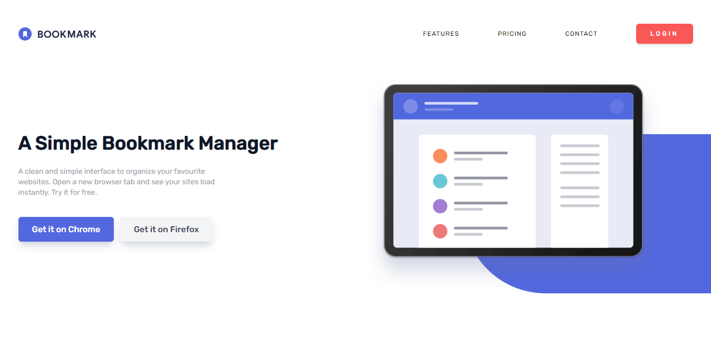
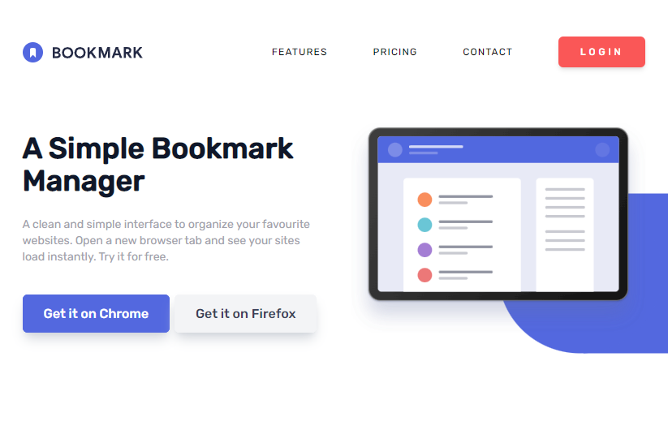
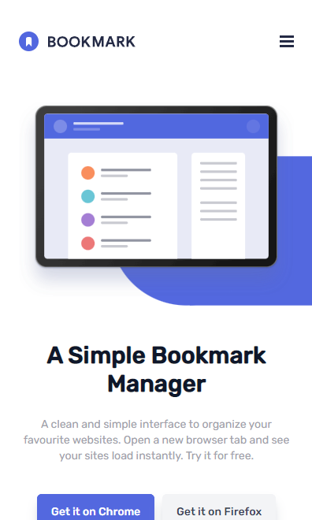

# Frontend Mentor - Bookmark landing page solution

This is a solution to the [Bookmark landing page challenge on Frontend Mentor](https://www.frontendmentor.io/challenges/bookmark-landing-page-5d0b588a9edda32581d29158). Frontend Mentor challenges help you improve your coding skills by building realistic projects. 

## Table of contents

- [Overview](#overview)
  - [The challenge](#the-challenge)
  - [Screenshot](#screenshot)
  - [Links](#links)
- [My process](#my-process)
  - [Built with](#built-with)
  - [What I learned](#what-i-learned)
  - [Continued development](#continued-development)
- [Author](#author)
- [Acknowledgments](#acknowledgments)

## Overview

### The challenge

Users should be able to:

- View the optimal layout for the site depending on their device's screen size
- See hover states for all interactive elements on the page
- Receive an error message when the newsletter form is submitted if:
  - The input field is empty
  - The email address is not formatted correctly

### Screenshot

### Links

- Solution URL: [Add solution URL here](https://your-solution-url.com)
- Live Site URL: [bookmark](https://issam-hub.github.io/bookmark-landing-page/)

## My process

### Built with

- HTML5
- CSS3
- javascript
- Flexbox
- CSS Grid
- Mobile-first workflow
- tailwind css

### What I learned

- i learned a lot this time, make a better menu, animation on scroll, validate and style a form, details and summmary tags and how to work with them, and more cool things

### Continued development

- i'm going to build more stuff with tailwind, i just love this framework

## Author

- Frontend Mentor - [@issam_hub](https://www.frontendmentor.io/profile/issam-hub)
- Instagram - [@issam_4real](https://www.instagram.com/issam_4real/)

## Acknowledgments

I Want To Thank Stackoverflow, Youtube Channels like fireship and Ag Coding. thanks a lot really

